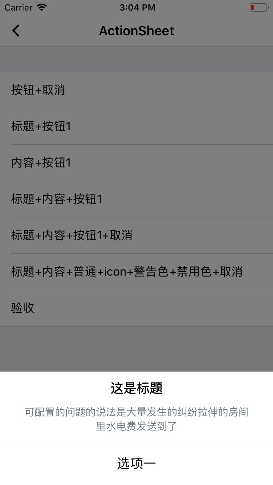
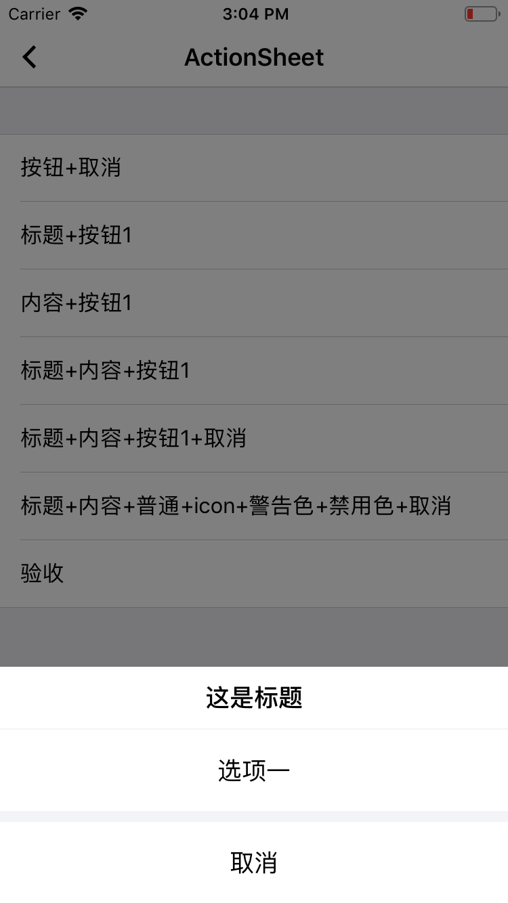
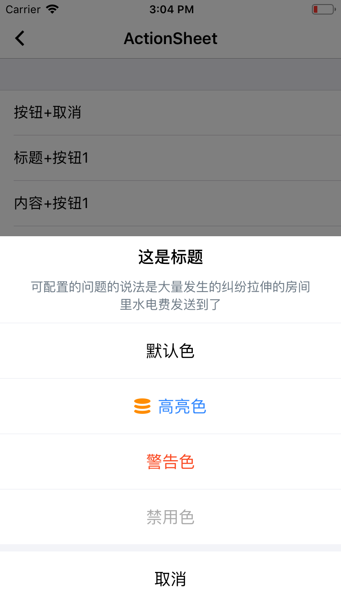

# ActionSheet

菜单动作列表

## 效果展示




标题+内容+动作1



标题+动作1+取消



标题+内容+icon动作+警告色+禁用+取消

## 使用方法

```
1. 菜单项 包括多种样式  普通、高亮、警告、禁用、取消
注意：取消项为可选项，但最多只能添加一个取消菜单项

EUIAction *action1 = [EUIAction actionWithTitle:@"默认色" style:EUIActionStyleDefault handler:^(EUIAction * _Nonnull action) {
     NSLog(@"选项一 Action");
}];
EUIAction *action2 = [EUIAction actionWithTitle:@"高亮色" icon:[UIImage imageNamed:@"wode_icon_xuefen"] style:EUIActionStyleHighlight handler:^(EUIAction * _Nonnull action) {
    NSLog(@"选项二 Action");
}];
EUIAction *action3 = [EUIAction actionWithTitle:@"警告色" style:EUIActionStyleDestructive handler:^(EUIAction * _Nonnull action) {
    NSLog(@"警告色 Action");
}];
EUIAction *action4 = [EUIAction actionWithTitle:@"禁用色" style:EUIActionStyleDefault handler:^(EUIAction * _Nonnull action) {
    NSLog(@"禁用 Action");
}];
action4.enabled = NO;
EUIAction *cancelAction = [EUIAction actionWithTitle:@"取消" style:EUIActionStyleCancel handler:^(EUIAction * _Nonnull action) {
    NSLog(@"Cancel Action");
}];

EUIActionSheetController *alertController = [EUIActionSheetController new];
alertController.title = @"这是标题";
alertController.message = @"可配置的问题的说法是大量发生的纠纷拉伸的房间里水电费发送到了";
alertController.shouldTouchBackgroundDismiss = NO;
[alertController addAction:action1];
[alertController addAction:action2];
[alertController addAction:action3];
[alertController addAction:action4];
[alertController addAction:cancelAction];
[alertController presentFromViewController:weakSelf];
```


