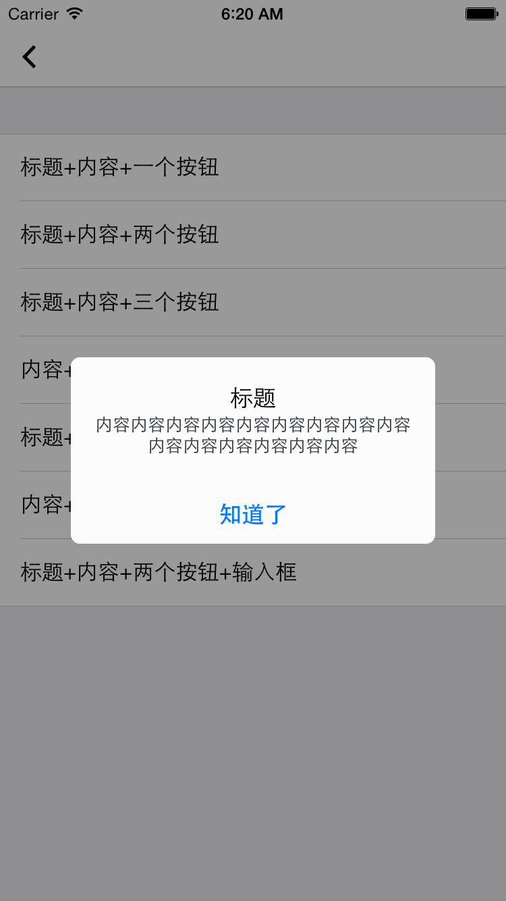
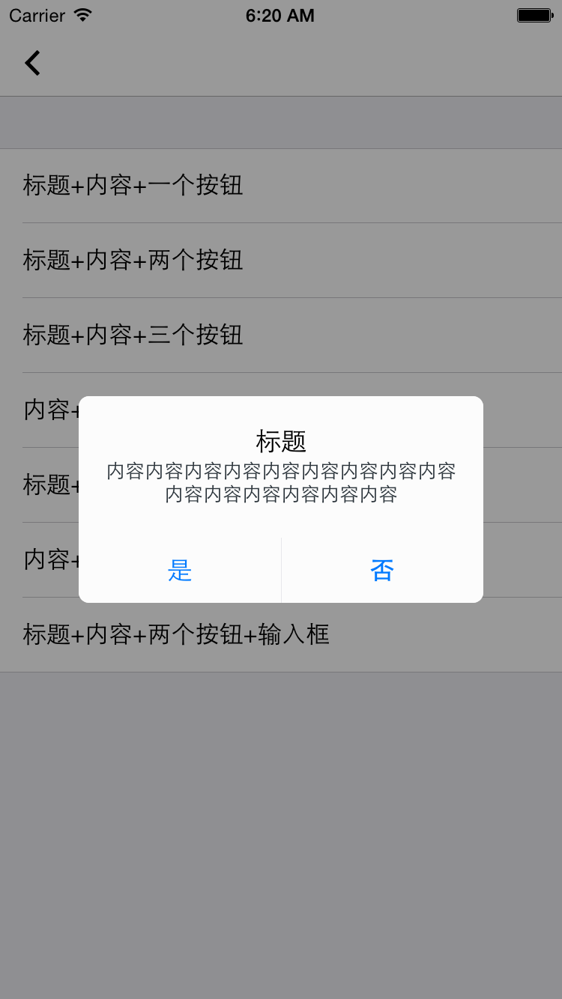
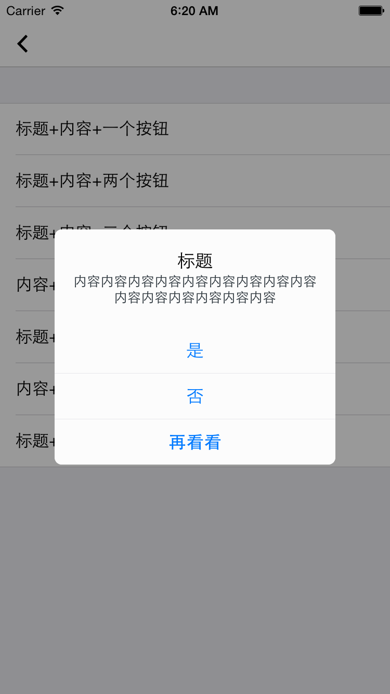
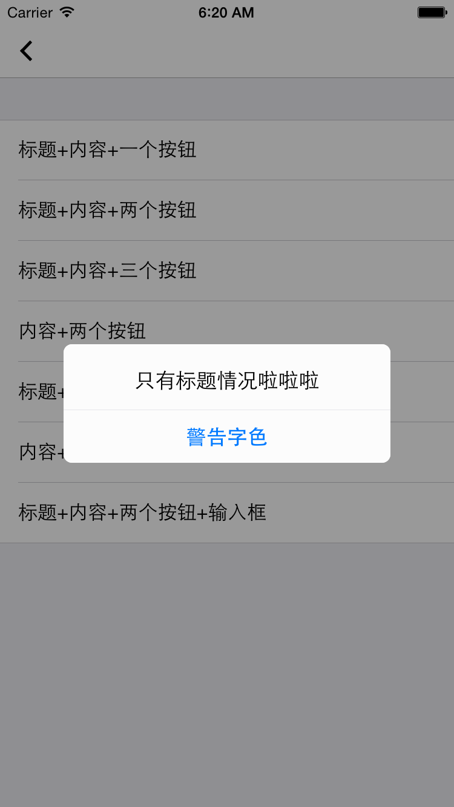
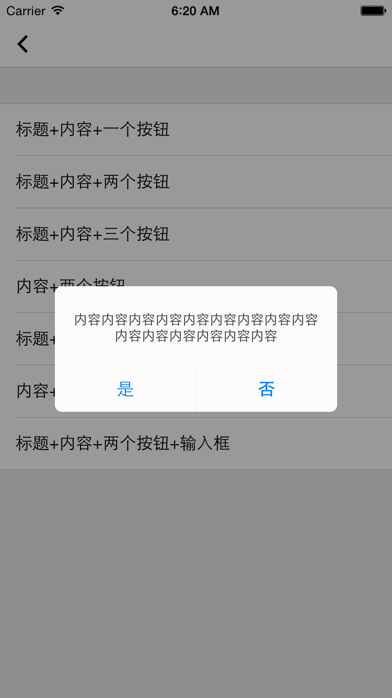
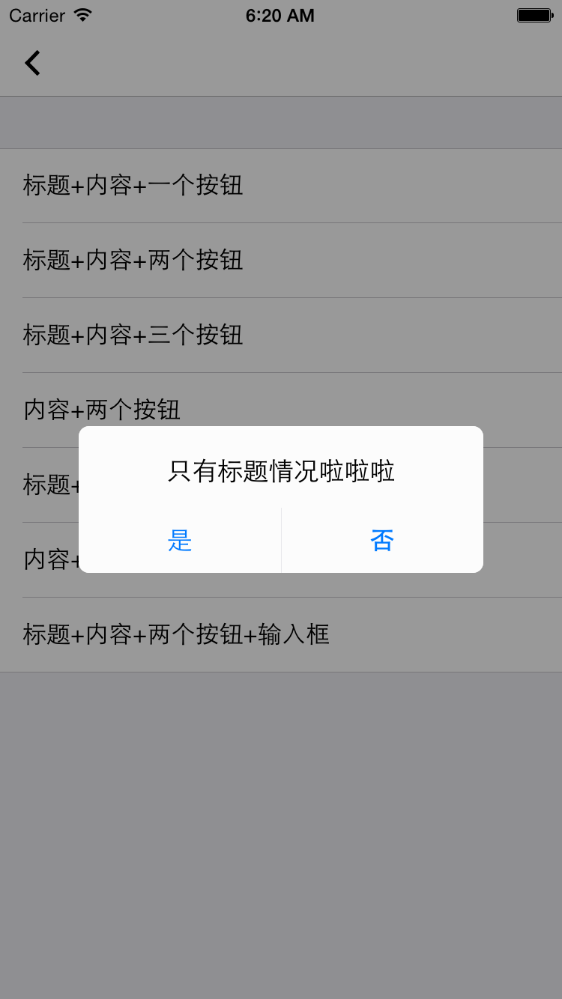
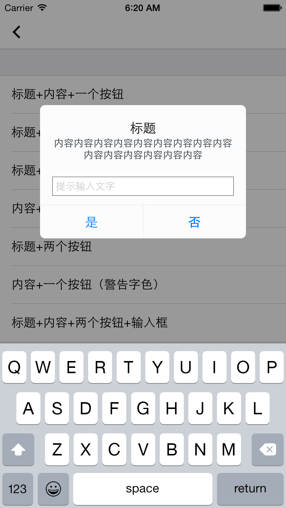

# Alert

弹窗组件

## 效果展示











## 使用方法

```
// 标题+内容+单个按钮
[EUIAlertView showAlertViewWithTitle:@"标题" message:@"内容内容内容内容内容内容内容内容内容内容内容内容内容内容内容" preferredStyle:UIAlertControllerStyleAlert viewController:self cancelItemTitle:@"知道了" ortherItemTitle:nil moreItemTitle:nil cancelAction:nil ortherAction:nil moreAction:nil];

// 标题+内容+2个按钮       
[EUIAlertView showAlertViewWithTitle:@"标题" message:@"内容内容内容内容内容内容内容内容内容内容内容内容内容内容内容" preferredStyle:UIAlertControllerStyleAlert viewController:self cancelItemTitle:@"是" ortherItemTitle:@"否" moreItemTitle:nil cancelAction:nil ortherAction:nil moreAction:nil];
    
// 标题+内容+3个按钮
[EUIAlertView showAlertViewWithTitle:@"标题" message:@"内容内容内容内容内容内容内容内容内容内容内容内容内容内容内容" preferredStyle:UIAlertControllerStyleAlert viewController:self cancelItemTitle:@"是" ortherItemTitle:@"否" moreItemTitle:@"再看看" cancelAction:nil ortherAction:nil moreAction:nil];

// 标题+内容+警告色按钮
[EUIAlertView showAlertViewWithTitle:@"只有标题情况啦啦啦" message:nil preferredStyle:UIAlertControllerStyleAlert viewController:self warningTitle:@"警告字色" warningAction:nil];

// 内容+2个按钮     
[EUIAlertView showAlertViewWithTitle:nil message:@"内容内容内容内容内容内容内容内容内容内容内容内容内容内容内容" preferredStyle:UIAlertControllerStyleAlert viewController:self cancelItemTitle:@"是" ortherItemTitle:@"否" moreItemTitle:nil cancelAction:nil ortherAction:nil moreAction:nil];

// 内容+2个按钮 
[EUIAlertView showAlertViewWithTitle:@"只有标题情况啦啦啦" message:nil preferredStyle:UIAlertControllerStyleAlert viewController:self cancelItemTitle:@"是" ortherItemTitle:@"否" moreItemTitle:nil cancelAction:nil ortherAction:nil moreAction:nil];

// 标题+内容+输入框+按钮     
[EUIAlertView showAlertTextFieldViewWithTitle:@"标题" message:@"内容内容内容内容内容内容内容内容内容内容内容内容内容内容内容" placeHolder:@"提示输入文字" preferredStyle:UIAlertControllerStyleAlert viewController:self cancelItemTitle:@"是" ortherItemTitle:@"否" cancelAction:nil ortherAction:nil];

```