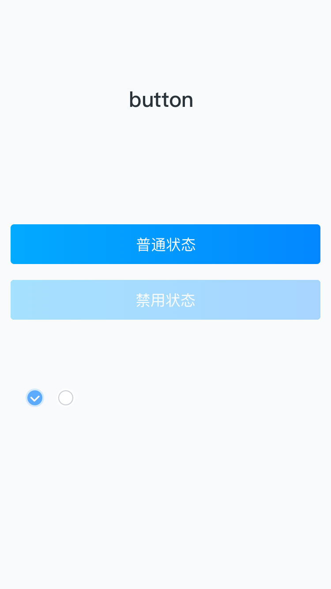

# Button

### 效果图
 

### 使用方式
<pre>
  EUIGradientButton* norBtn = [EUIGradientButton buttonWithType:UIButtonTypeCustom];
    norBtn.frame = CGRectMake(12, 200, self.view.width - 12*2, 45);
    norBtn.gradientColors = @[
                                     (id)[HEXACOLOR(0x02AAFF, 1.0) CGColor],
                                     (id)[HEXACOLOR(0x0387FF , 1.0) CGColor]
                                     ];
    [norBtn addTarget:self action:@selector(changeState:) forControlEvents:UIControlEventTouchUpInside];
    [norBtn setTitle:@"普通状态" forState:UIControlStateNormal];
    [norBtn setTitle:@"禁用状态" forState:UIControlStateDisabled];
    [self.view addSubview:norBtn];
</pre>

### API

 | 属性 | 说明 | 类型 | 默认 |
 | ------------- |------------- | ----- |
 | gradientColors | 渐变颜色组 | boolean | null |
 | showGradient | 是否显示渐变效果 | boolean | false |
 