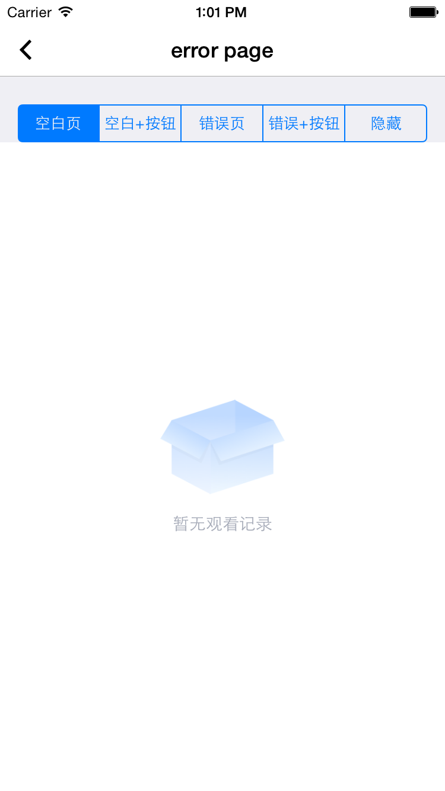
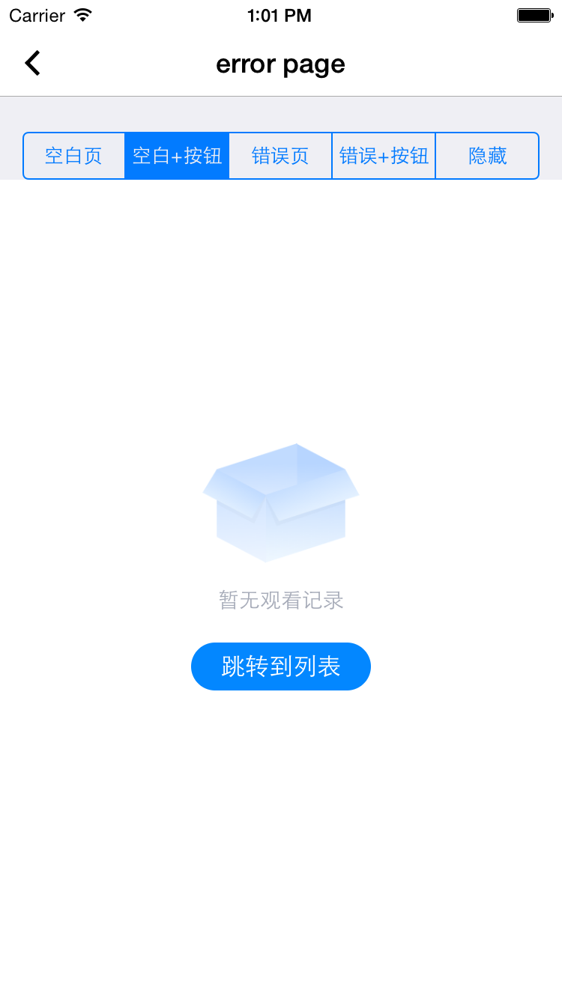
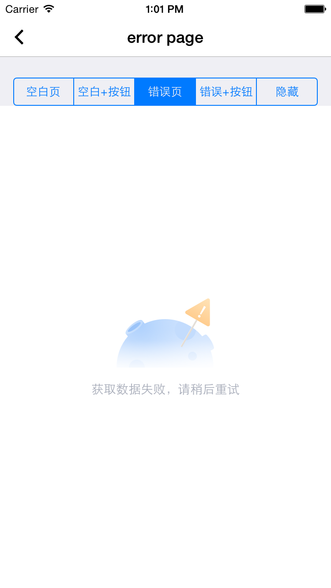
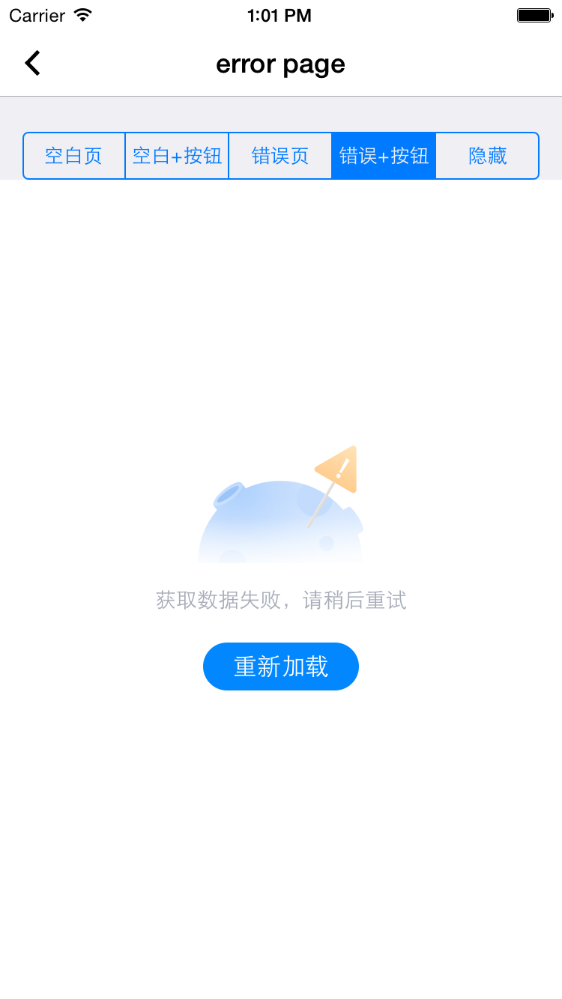
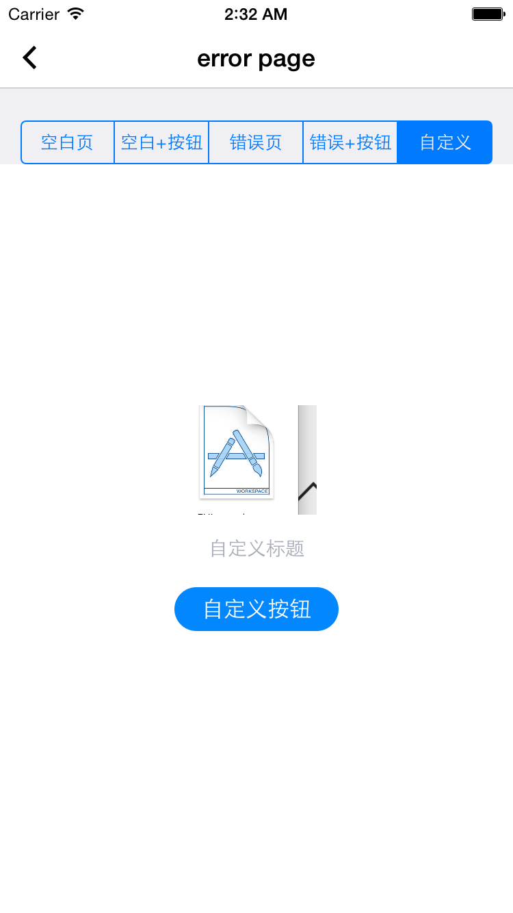

# EWTErrorPage

错误页/空白页，包含图片，标题，按钮三个UI元素

## 效果展示

<center>

空白页
</center> 

<center>

空白页+按钮
</center> 

<center>

错误页
</center>                         

<center>

错误页+按钮
</center> 

<center>

自定义
</center> 


## 使用方法

```
// 空白页
[self.contentView showBlankPage:@"暂无观看记录"];

// 空白页 + 按钮
[self.contentView showBlankPage:@"暂无观看记录" actionTitle:@"跳转到列表" actionHandler:^ {
    NSLog(@"jump to list view");
}];

// 错误页
[self.contentView showErrorPage:@"获取数据失败，请稍后重试" actionHandler:nil];

// 错误页+按钮
[self.contentView showErrorPage:@"获取数据失败，请稍后重试" actionHandler:^{
    NSLog(@"你点击了重试按钮");
}];

// 通用方法
- (void)showErrorPage:(NSString * _Nullable)title
                image:(UIImage * _Nonnull)image
          actionTitle:(nullable NSString *)actionTitle
        actionHandler:(nullable void(^)(void))actionHandler;

```

## 特别说明
1. 空白页和错误页采用的同一套使用UI展现，可以使用通用方法去适应各种情况；

`
 (void)showErrorPage:(NSString * _Nullable)title
                image:(UIImage * _Nonnull)image
          actionTitle:(nullable NSString *)actionTitle
        actionHandler:(nullable void(^)(void))actionHandler;
`

2. 空白页标题可以传参nil，此时将显示预置的默认标题“这里是一片荒野”, 如果想不带标题，参数传@""即可

`
 [self.contentView showBlankPage:nil];
`

3. 错误页标题可以传参nil，此时将显示预置的默认标题“页面走丢了，请稍后重试”, 如果想不带标题，参数传@""即可

`
 [self.contentView showErrorPage:nil actionHandler:nil];
`


