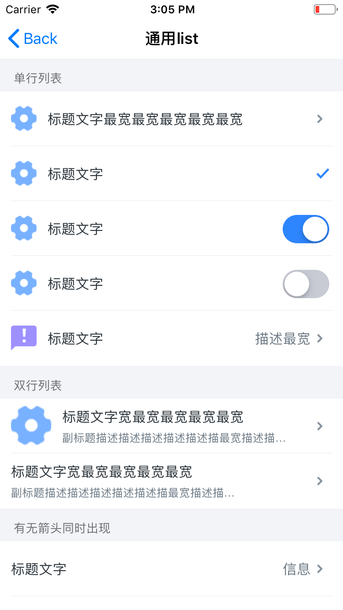

# list

通用列表

## 效果展示




通用列表

## 使用方法

通用列表
1. 列表组样式 
 - 文字

2. 列表项样式 
 - icon(可选)  显示在最左侧
 - 标题 
 - 副标题(可选)
 - 文字 
 - 描述(可选) 最右侧
 - 选中对号(可选) 最右侧
 - 开关(可选) 最右侧

```
// section0
EWTArrowItem *item01 = [EWTArrowItem itemWithTitle:@"标题文字最宽最宽最宽最宽最宽" subTitle: nil className:[EWTSettingCell class]];
item01.cellHeight = 60;
item01.image = [UIImage imageNamed:@"wode_icon_shezhi"];

EWTCheckItem *item02 = [EWTCheckItem itemWithTitle:@"标题文字" subTitle: nil className:[EWTSettingCell class]];
item02.cellHeight = 60;
item02.isChoose = YES;
item02.image = [UIImage imageNamed:@"wode_icon_shezhi"];

EWTSwitchItem *item03 = [EWTSwitchItem itemWithTitle:@"标题文字" subTitle: nil className:[EWTSettingCell class]];
item03.cellHeight = 60;
item03.isChoose = YES;
[item03 setItemSwitchOperation:^(UISwitch *sw) {
    
}];
item03.image = [UIImage imageNamed:@"wode_icon_shezhi"];

EWTSwitchItem *item04 = [EWTSwitchItem itemWithTitle:@"标题文字" subTitle: nil className:[EWTSettingCell class]];
item04.cellHeight = 60;
item04.isChoose = NO;
[item04 setItemSwitchOperation:^(UISwitch *sw) {
    
}];
item04.image = [UIImage imageNamed:@"wode_icon_shezhi"];


EWTArrowItem *item05 = [EWTArrowItem itemWithTitle:@"标题文字" subTitle:nil detailTitle:@"描述最宽" className:[EWTSettingCell class]];
item05.cellHeight = 60;
item05.image = [UIImage imageNamed:@"wode_icon_fankui"];

EWTTableViewSectionData *section0 = [EWTTableViewSectionData sectionWithItems:@[item01, item02, item03, item04, item05] andHeaderTitle:@"单行列表" footerTitle:nil];
section0.headerHeight = 36;
section0.footerHeight = 0;

//section1
EWTArrowItem *item11 = [EWTArrowItem itemWithTitle:@"标题文字" subTitle:nil detailTitle:@"信息" className:[EWTSettingCell class]];
item11.cellHeight = 60;

EWTStaticCellData *item12 = [EWTStaticCellData itemWithTitle:@"标题文字" subTitle:nil detailTitle:@"三年二班" className:[EWTSettingCell class]];
item12.cellHeight = 60;

EWTTableViewSectionData *section1 = [EWTTableViewSectionData sectionWithItems:@[item11, item12] andHeaderTitle:@"有无箭头同时出现" footerTitle:nil];
section1.headerHeight = 36;
section1.footerHeight = 0;


//section2
EWTArrowItem *item21 = [EWTArrowItem itemWithTitle:@"标题文字" subTitle: nil className:[EWTSettingCell class]];
item21.cellHeight = 60;

EWTArrowItem *item22 = [EWTArrowItem itemWithTitle:@"标题文字" subTitle:nil detailTitle:@"信息" className:[EWTSettingCell class]];
item22.cellHeight = 60;
EWTTableViewSectionData *section2 = [EWTTableViewSectionData sectionWithItems:@[item21, item22] andHeaderTitle:@"有箭头" footerTitle:nil];
section2.headerHeight = 36;
section2.footerHeight = 0;

//section3
EWTStaticCellData *item31 = [EWTStaticCellData itemWithTitle:@"标题文字" subTitle: nil className:[EWTSettingCell class]];
item31.cellHeight = 60;

EWTStaticCellData *item32 = [EWTStaticCellData itemWithTitle:@"标题文字" subTitle:nil detailTitle:@"信息" className:[EWTSettingCell class]];
item32.cellHeight = 60;

EWTTableViewSectionData *section3 = [EWTTableViewSectionData sectionWithItems:@[item31, item32] andHeaderTitle:@"无箭头" footerTitle:nil];
section3.headerHeight = 36;
section3.footerHeight = 0;

//section4
EWTArrowItem *item41 = [EWTArrowItem itemWithTitle:@"标题文字宽最宽最宽最宽最宽" subTitle: @"副标题描述描述描述描述描述描最宽描述描最宽" className:[EWTSettingCell class]];
item41.cellHeight = 60;
item41.image = [UIImage imageNamed:@"wode_icon_shezhi"];

EWTArrowItem *item42 = [EWTArrowItem itemWithTitle:@"标题文字宽最宽最宽最宽最宽" subTitle: @"副标题描述描述描述描述描述描最宽描述描最宽" className:[EWTSettingCell class]];
item42.cellHeight = 60;

EWTTableViewSectionData *section4 = [EWTTableViewSectionData sectionWithItems:@[item41, item42] andHeaderTitle:@"双行列表" footerTitle:nil];
section4.headerHeight = 36;
section4.footerHeight = 0;

[self.sections addObject:section0];
[self.sections addObject:section4];
[self.sections addObject:section1];
[self.sections addObject:section2];
[self.sections addObject:section3];

```
