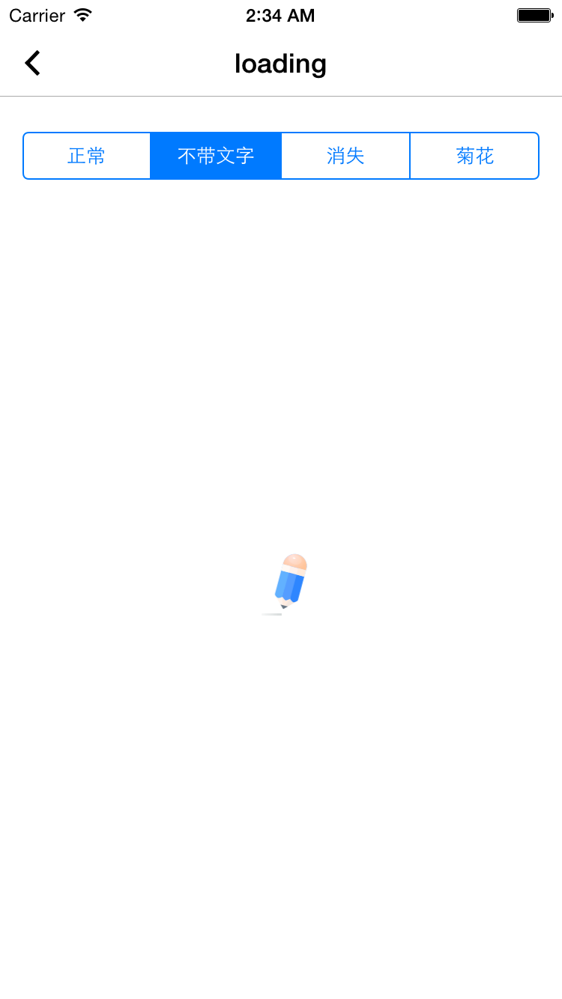
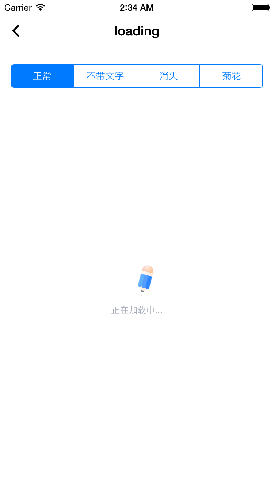
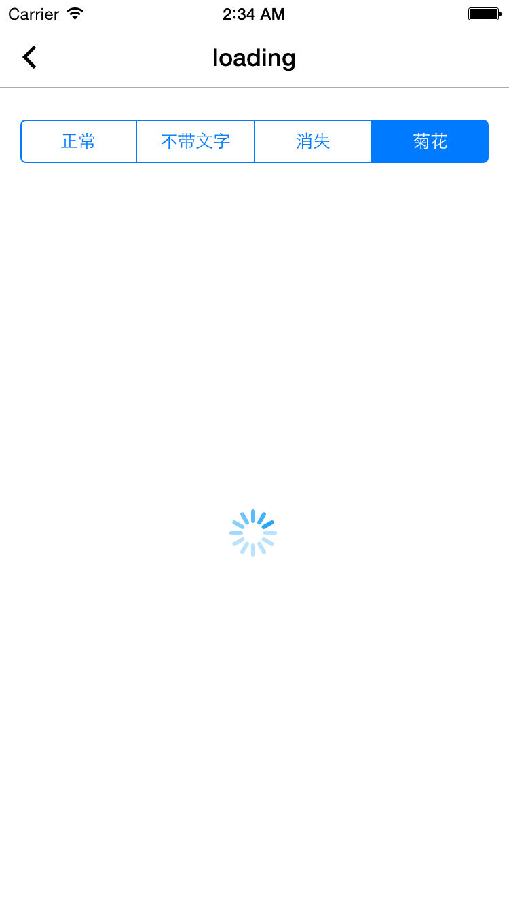

# EWTLoading

加载效果，包含铅笔动画+文字

## 效果展示



铅笔



铅笔+文字

                    


菊花


## 使用方法

```
// 铅笔动画
[_contentView showEWTLoadingWithTitle:@""];

// 铅笔动画 + 文字
[_contentView showEWTLoadingWithTitle:@"正在加载中..."];

// 菊花转圈加载效果
[MBProgressHUD showLoadingToView:_contentView];

```


