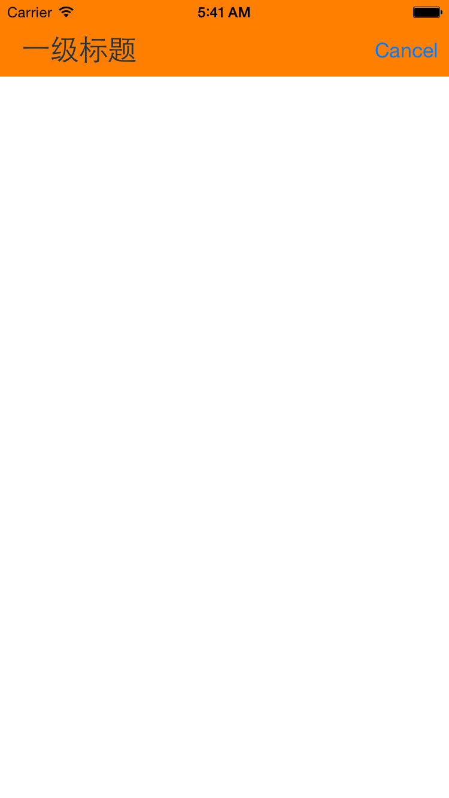
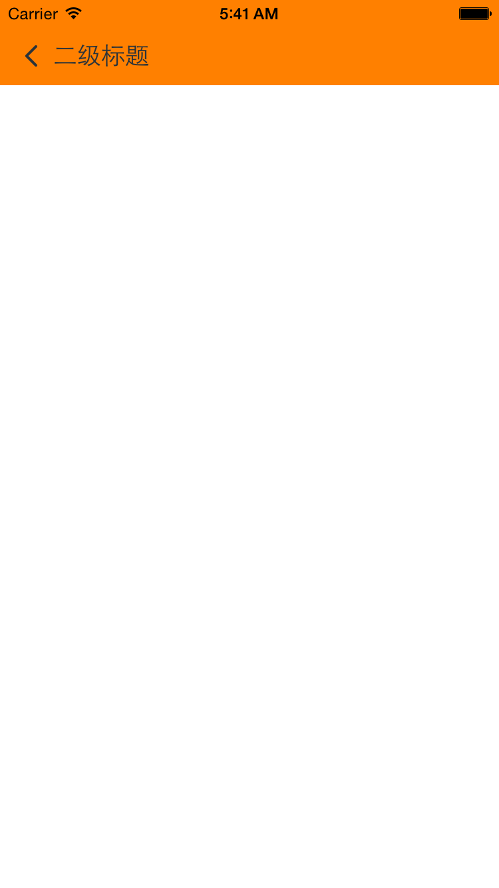

# NavigationBar
导航栏标题，分为一级标题和二级标题

## 效果展示

<center>

一级标题
</center> 

<center>

二级标题
</center>                       


## 使用方法

```
// 下拉配置
useEWTRefreshHeaderWithTarget:(id)target action:(SEL)action

// 上拉
[_tableView useWETRefreshFotterWithTarget:self action:@selector(more)];

// 长拉
[_tableView useEWTRefreshHeaderWithTarget:self action:@selector(refresh) pullingViewController:[EUIPullingViewController new]];
```


