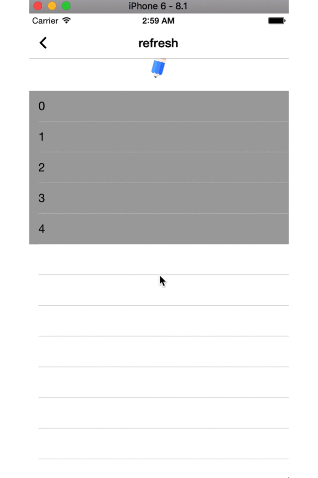
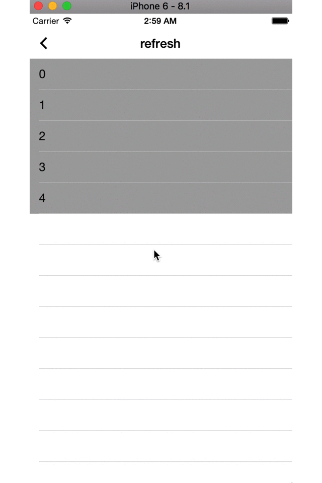
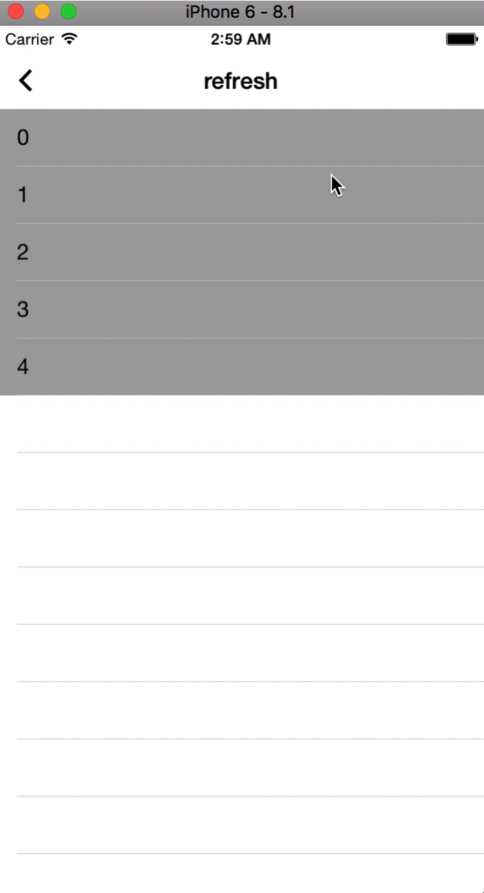

# Refreshing

刷新组件，包括下拉刷新，上拉加载，长拉触发进入第二vc

## 效果展示

<center>

下拉刷新
</center> 

<center>

上拉加载
</center> 

<center>

长拉进入第二vc
</center>                         


## 使用方法

```
// 下拉配置
useEWTRefreshHeaderWithTarget:(id)target action:(SEL)action

// 上拉
[_tableView useWETRefreshFotterWithTarget:self action:@selector(more)];

// 长拉
[_tableView useEWTRefreshHeaderWithTarget:self action:@selector(refresh) pullingViewController:[EUIPullingViewController new]];
```


