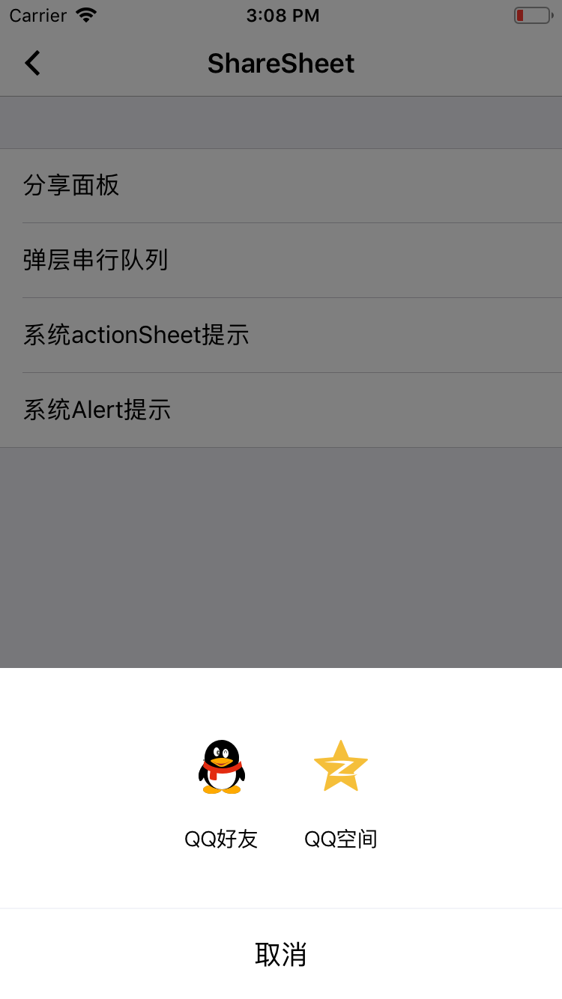
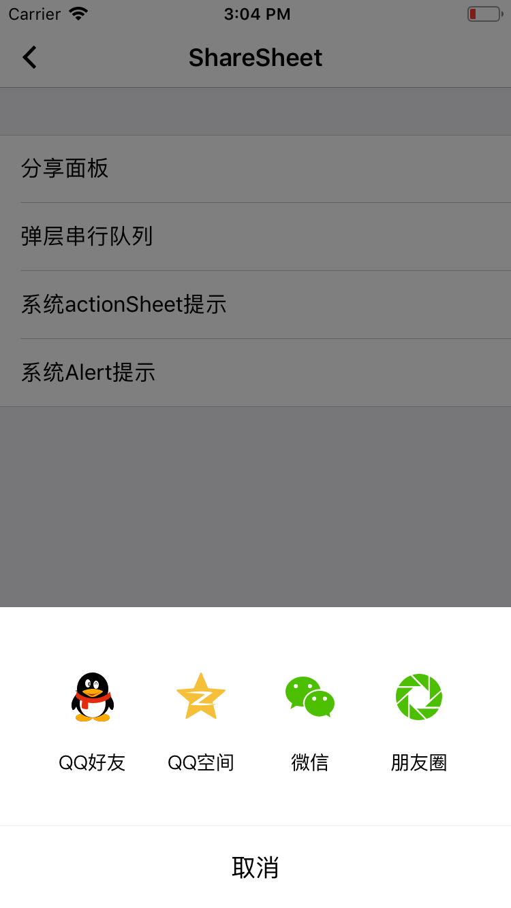

# ShareSheet

分享面板 支持 微信好友/微信朋友圈/QQ好友/QQ空间

## 效果展示




QQ好友+QQ空间



QQ好友+QQ空间+微信好友+微信朋友圈

## 使用方法

```
EUIShareSheetController *alertController = [EUIShareSheetController new];
[alertController addShareType:EUIShareTypeQQ actionHandler:^{
    NSLog(@"点击了QQ好友");
}];
[alertController addShareType:EUIShareTypeQZone actionHandler:^{
    NSLog(@"点击了QQ空间");
}];
[alertController addShareType:EUIShareTypeWechat actionHandler:^{
    NSLog(@"点击了微信");
}];
[alertController addShareType:EUIShareTypeSocial actionHandler:^{
    NSLog(@"点击了朋友圈");
}];
[alertController presentFromViewController:weakSelf];

```
