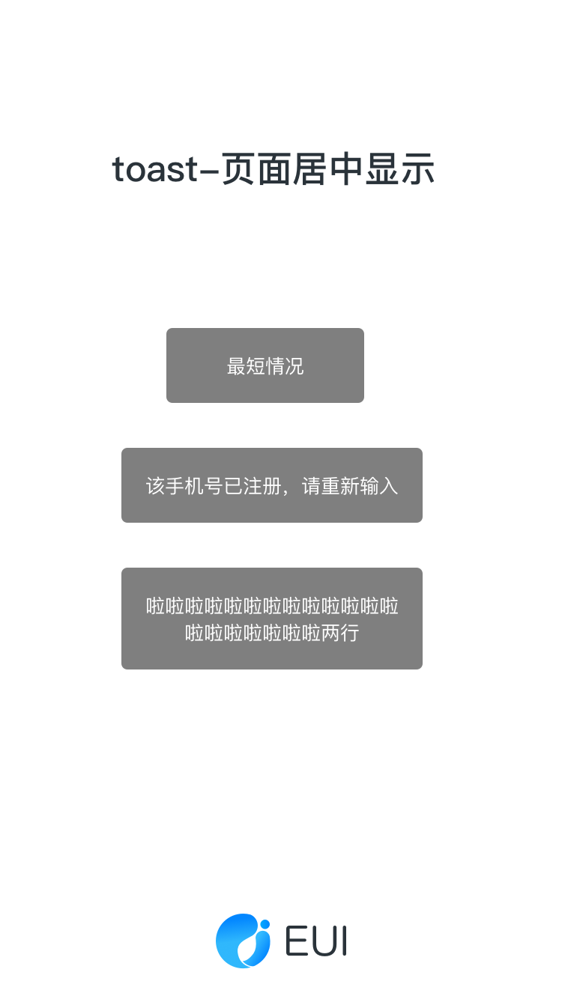

# Toast

### 效果图
 

### 使用方式
<pre>
  [MBProgressHUD toastMessage:message ToView:self.view];

  [MBProgressHUD toastMessage:message ToView:view RemainTime:1.5];
  
</pre>

### API
+(void)toastMessage:(NSString *)message ToView:(UIView *)view;

 | 属性 | 说明 | 类型 | 默认 |
 | ------------- |------------- | ----- |
 | message | 显示的文字| string | null |
 | view | 显示的view | UIView | window |
 
 +(void)toastMessage:(NSString *)message ToView:(UIView *)view RemainTime:(CGFloat)time;

 | 属性 | 说明 | 类型 | 默认 |
 | ------------- |------------- | ----- |
 | message | 显示的文字 | string | null |
 | view | 显示的view | UIView | window |
 | time | 停留时间 | CGFloat | 1.5s |
